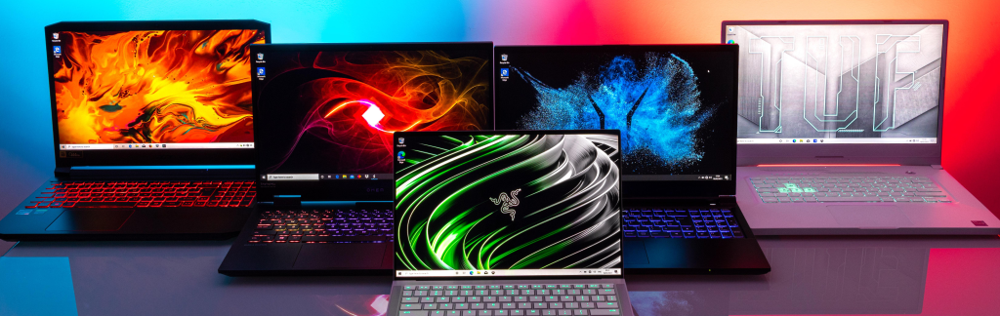

# Laptop Data Cleaning Project



## Overview
This project focuses on cleaning the "SmartPrix Laptop Unclean Dataset" obtained from Kaggle. The dataset includes various attributes of laptops such as price, specifications, and user ratings. The goal of this project is to demonstrate data cleaning techniques including handling missing values, duplicates, and outliers.

## Dataset
The dataset used in this project contains the following columns:
- **name**: The name of the laptop.
- **price**: Price of the laptop.
- **spec_score**: Specification score of the laptop.
- **votes**: Number of votes from users.
- **user_rating**: User ratings for the laptop.
- **os**: Operating system installed on the laptop.
- **utility**: Intended utility or use-case.
- **thickness**: Thickness of the laptop.
- **weight**: Weight of the laptop.
- **warranty**: Warranty period.
- **screen_size**: Size of the screen.
- **resolution**: Screen resolution.
- **ppi**: Pixel density (PPI) of the screen.
- **battery**: Battery capacity.
- **screen_feature1** and **screen_feature2**: Additional screen features.
- **processor_name**: Name of the processor.
- **processor_speed**: Processor's speed.
- **no_cores**: Number of cores in the processor.
- **caches**: Processor cache size.
- **graphics_card**: Graphics card model.
- **rom_memory**: ROM size.
- **internal_memory**: RAM size.
- **port_connection**: Available ports and connections.
- **wireless_connection**: Wireless connection details.
- **usb_ports**: USB port details.
- **hardware_features**: Additional hardware features.

## Project Highlights
- Handling missing and inconsistent data.
- Removing duplicate rows.
- Standardizing data types.
- Identifying and treating outliers.
- Generating a cleaned dataset for further analysis.

## Tech Stack
- **Python**: Primary programming language.
- **Pandas**: For data manipulation and cleaning.
- **Jupyter Notebook**: For organizing and running the code.

## Setup Instructions

### 1. Clone the Repository
```bash
git clone https://github.com/yourusername/laptop-data-cleaning.git
cd laptop-data-cleaning
```

### 2. Create and Activate Virtual Environment
- **Create virtual environment**:
  ```bash
  python3 -m venv venv
  ```
- **Activate the environment**:
  - On **Linux/MacOS**:
    ```bash
    source venv/bin/activate
    ```
  - On **Windows**:
    ```bash
    venv\Scripts\activate
    ```

### 3. Install Required Libraries
Install all required libraries using the `requirements.txt` file:
```bash
pip install -r requirements.txt
```

### 4. Open Jupyter Notebook
Run the project in Jupyter Notebook:
```bash
jupyter notebook
```

## Usage
- Open the `laptop_data_cleaning.ipynb` notebook to explore the data cleaning process.
- Follow the instructions in the notebook to apply cleaning techniques to the raw dataset.

## Future Improvements
- Feature engineering for machine learning.
- Exploratory data analysis (EDA) and visualization.
- Building predictive models using the cleaned data.

## License
This project is licensed under the MIT License. See the [LICENSE](LICENSE) file for details.
